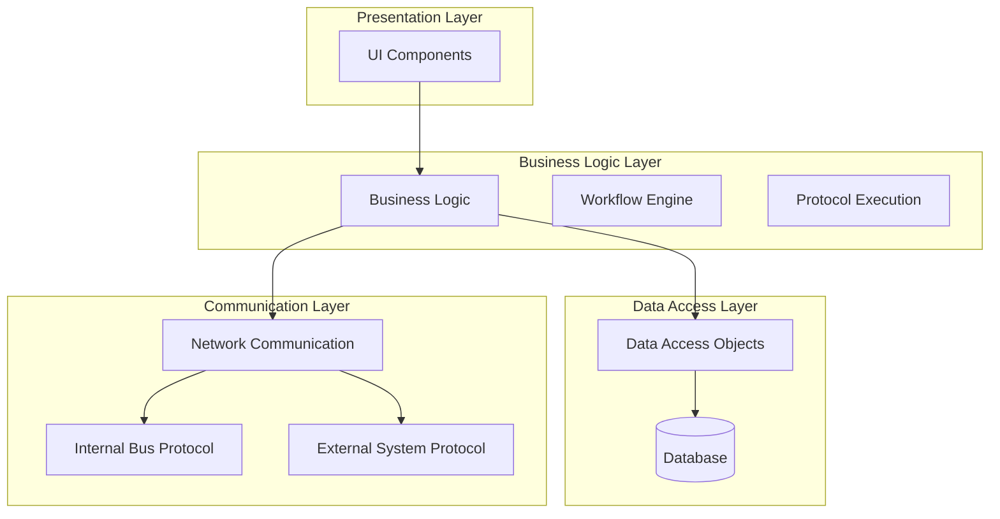
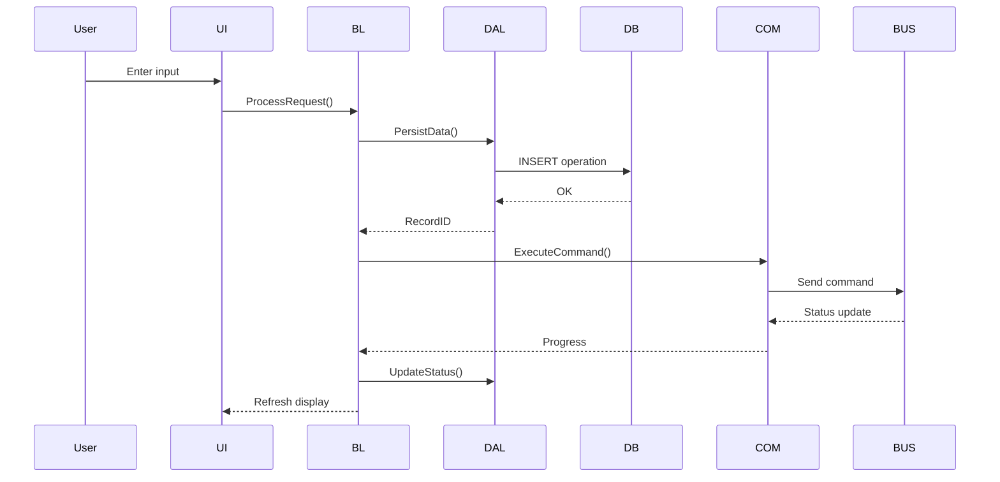

# Software Architecture Document (SW-SAD)

**Document ID:** {PROJECT_NUMBER}_CD_{COMPONENT}_SAD_v{MAJOR}.{MINOR}  
**Component:** {COMPONENT_NAME} (AC / AD / AF)  
**Project:** {PROJECT_NAME}  
**Safety Class:** {SAFETY_CLASS} (IEC 62304)  
**Version:** v00.01 (Draft)  
**Date:** {DATE}  
**Author:** Software Architect  
**Reviewer:** System Architect  

---

## 1. Introduction

### 1.1 Purpose
This document describes the software architecture for the **{COMPONENT_NAME}** component of {PROJECT_NAME}.

### 1.2 Scope
The architecture covers:
- Architectural drivers and decisions
- Component decomposition
- Component interactions and interfaces
- Data architecture
- Deployment architecture

### 1.3 References
- System Architecture: `../../01_SystemArchitecture/SystemArchitecture_SyAD.md`
- Software Requirements: `../../../01_Requirements/03_SoftwareReqs/SoftwareRequirements_SRS.md`
- IEC 62304:2006+AMD1:2015 §5.3

## 2. Architecture Overview

### 2.1 Architecture Drivers
| Driver | Description |
|--------|-------------|
| Modularity | Plugin-based architecture for assay protocols |
| Testability | Dependency injection, mockable interfaces |
| Safety | Separation of safety-critical from non-critical code |
| Performance | Real-time device control with bounded latency |
| Portability | Cross-platform GUI (Windows/Linux) |

### 2.2 Architecture Style
{ARCHITECTURE_STYLE} (e.g., Layered Architecture, Model-View-Controller, Microkernel, Plugin Architecture)

### 2.3 High-Level Diagram

*Replace with actual architecture diagram specific to your project.*

## 3. Component Decomposition

### 3.1 Component List

| Component ID | Name | Type | Responsibility | Safety Critical |
|-------------|------|------|---------------|-----------------|
| COMP-UI-01 | MainWindow | UI | Main application window | No |
| COMP-BL-01 | WorkflowEngine | Business | Process workflow management | Yes |
| COMP-BL-02 | ResultCalculator | Business | Test result calculation | Yes |
| COMP-DAL-01 | SampleRepository | Data | Sample data persistence | Yes |
| COMP-COM-01 | CANController | Communication | CAN bus communication | Yes |
| COMP-COM-02 | LISConnector | Communication | LIS protocol handling | Yes |

### 3.2 Component Specifications

#### COMP-{ID}: {NAME}
- **Type:** {TYPE}
- **Responsibility:** {RESPONSIBILITY}
- **Interfaces:**
  - Provides: `{interface_name}`
  - Requires: `{interface_name}`
- **Dependencies:** {COMPONENT_LIST}
- **Safety Classification:** {SAFETY_CLASS}
- **Assigned Requirements:**
  - {REQ-ID}
- **Design Rationale:** {RATIONALE}

## 4. Interface Specifications

### 4.1 Internal Interfaces

#### Interface: {NAME}
- **Between:** Component A ↔ Component B
- **Type:** {SYNC_CALL / ASYNC_MESSAGE / EVENT}
- **Protocol:** {PROTOCOL}
- **Data Format:** {FORMAT}
- **Error Handling:** {ERROR_STRATEGY}

### 4.2 External Interfaces
See system architecture interface specifications.

## 5. Data Architecture

### 5.1 Data Model
Refer to `DataModel.md` for the complete database schema.

### 5.2 Key Entities
| Entity | Description | Safety Critical |
|--------|-------------|-----------------|
| Sample | Sample information | Yes |
| Result | Test result data | Yes |
| Protocol | Protocol definition | Yes |
| User | System user account | No |
| AuditLog | Audit trail entry | Yes |

### 5.3 Data Flow

## 6. Safety Architecture (IEC 62304 §5.3)

### 6.1 Safety-Critical Components
| Component | Hazard | Safety Mechanism |
|-----------|--------|-----------------|
| {COMPONENT} | {HAZARD} | {MECHANISM} |

### 6.2 Segregation
Safety-critical components are separated from non-critical components by:
- {SEGREGATION_MECHANISM}

### 6.3 Fault Tolerance
| Mechanism | Implementation | Coverage |
|-----------|---------------|----------|
| Watchdog Timer | Hardware watchdog | System hang detection |
| Data Validation | Input sanitization | Prevent data corruption |
| Redundant Storage | Database replication | Prevent data loss |

## 7. SOUP Management (IEC 62304 §5.3.3)

| SOUP Component | Version | License | Risk Analysis | Mitigation |
|---------------|---------|---------|---------------|------------|
| Framework/Library | {VERSION} | {LICENSE} | {RISK} | {MITIGATION} |
| Database | {VERSION} | {LICENSE} | {RISK} | {MITIGATION} |
| Crypto/TLS Library | {VERSION} | {LICENSE} | {RISK} | {MITIGATION} |

## 8. Architecture Decisions (ADR)

### ADR-{NNN}: {TITLE}
- **Date:** {DATE}
- **Status:** {PROPOSED / ACCEPTED / SUPERSEDED}
- **Context:** {CONTEXT}
- **Decision:** {DECISION}
- **Consequences:** {CONSEQUENCES}
- **Alternatives:** {ALTERNATIVES}

## 9. Document History

| Version | Date | Author | Changes |
|---------|------|--------|---------|
| v00.01 | {DATE} | {AUTHOR} | Initial draft |

---

*Template version: 1.0 | IEC 62304 §5.3 compliant*
